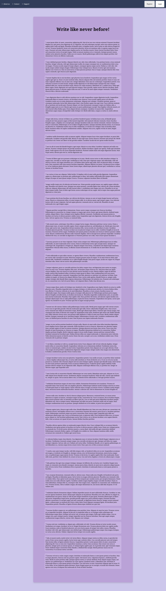
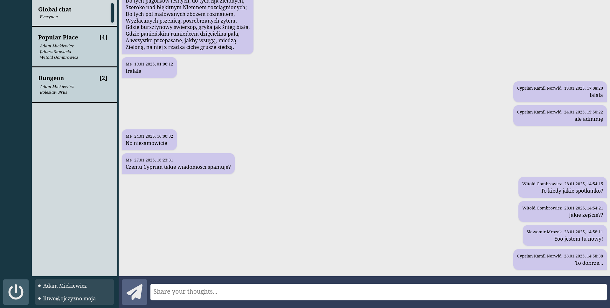
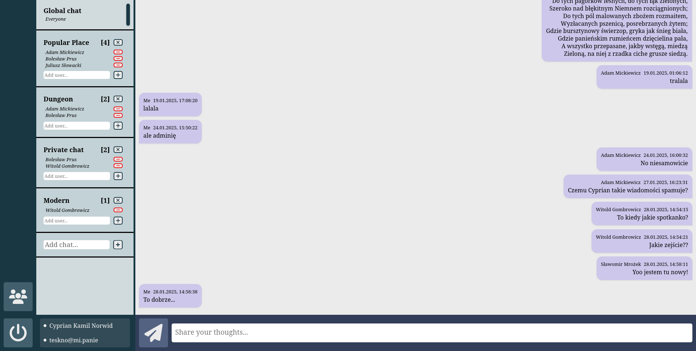
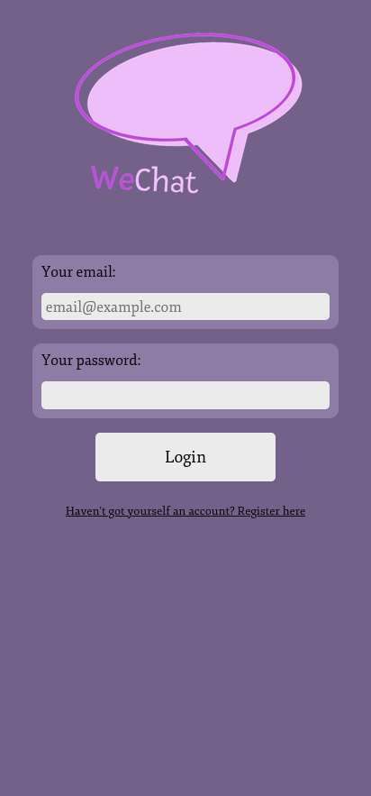
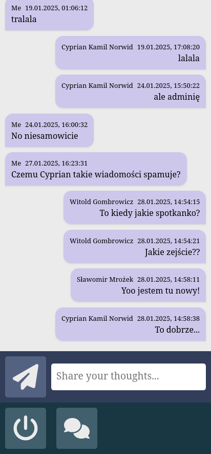

# Wechat
Aplikacja internetowa pozwalająca na komunikację z bliskimi i znajomymi w prosty i wygodny sposób. Użytkownicy wypowiadają się na wspólnych czatach, gdzie każdy ma szansę podzielić się swoimi myślami.

## Funkcjonalności serwisu
- Logowanie i podtrzymywanie sesji,
- Podział na użytkowników i administratorów,
- Dodawanie wiadomości i wyświetlanie ich w kanałach,
- Dodawanie i usuwanie kanałów,
- Dodawanie i usuwanie użytkowników z kanałów,
- Routing,
- Responsywny desing.

## Technologie
- PHP 8.2.11,
- Postgresql,
- Nginx,
- HTML, CSS, JS.

## Konfiguracja i uruchomienie
- Sklonuj repozytorium projektu,
- Zbuduj i uruchom kontenery za pomocą pliku docker/docker-compose.yaml:
>**docker compose up -d --build**
- Połącz się z aplikacją na porcie :8080.

Otrzymasz w ten sposób aplikację z nową, czystą bazą danych. Aby zaimportować testową bazę danych:
- Skopiuj *docker/postgresql/wdpai_db_dump.sql* do folderu *data/database*. Ta operacja może wymagać uprawnień administratorskich,
- Połącz się z kontenerem postgresql-wdpai:
>**docker exec -it postgresql-wdpai sh**
- Zresetuj bazę danych:
>**dropdb --username "\$POSTGRES_USER" wdpai**
>**createdb --username "\$POSTGRES_USER" wdpai**
- Wczytaj dane ze zrzutu do bazy danych:
>**psql --single-transaction --username "\$POSTGRES_USER" -d wdpai < /var/lib/postgresql/data/wdpai_db_dump.sql**

W ten sposób załadujesz testową bazę. Dane logowania do kont z testowej bazy danych znajdują się w pliku *docker/postgresql/README.txt*

## Struktura projektu
- *data/database* - Wolumin skonteneryzowanej bazy danych,
- *data/app* - Zawiera pliki odpowiedzialne za wygląd i działanie aplikacji,
- *data/app/static* - Wszystkie pliki graficzne, arkusze stylów i skrypty JS,
- *data/app/content* - Pliki PHP projektu,
- *data/app/content/templates* - Szkice HTML ważnych stron aplikacji,
- *data/app/content/managers* - Definicje klas potrzebnych do działania serwisu,
- *data/app/content/endpoints* - Serwisy odpowiadające na zapytania FETCH API,
- *docker* - Zawiera definicje i pliki konfiguracyjne kontenerów Dockerowych,
- *docs* - Zawiera dokumentację projektu wraz ze zdjęciami
- *docs/views* - Wybrane widoki aplikacji

## Q&A
Jak włączyć uprawnienia administratorskie konta?
-
- Połącz się z kontenerem postgresql-wdpai:
>**docker exec -it postgresql-wdpai sh**
- Zaloguj się do bazy danych:
> **psql --username "\$POSTGRES_USER" --dbname "\$POSTGRES_DB"**
- W bazie danych *user_data* zmień wartość w odpowiednim wierszu w kolumnie is_admin na **true**
